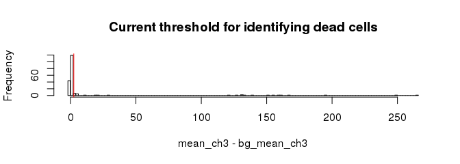
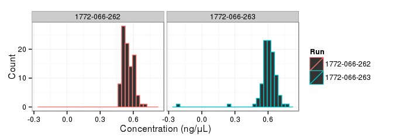
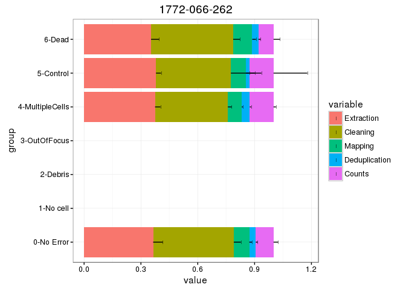
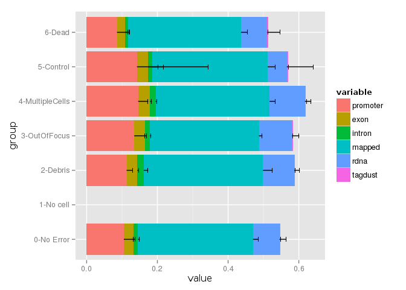
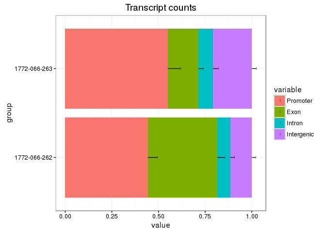
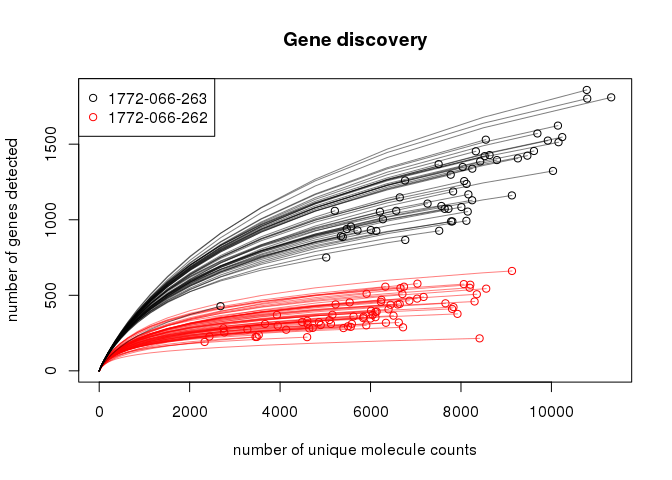

Sample C1 CAGE libraries comparing PrimeScript to SuperScript III.
==================================================================

This is a preview of the C1 CAGE technology.  We made two C1 runs differing by
the RT enzyme used: PrimeScript or SuperScript III, and sequenced them in
multiplex on a MiSeq v2 kit.

__Warning: this is unpublished results to show what C1 CAGE libraries look like.
A proper enzyme benchmark needs replicates, but this is out of the scope of
this document.__

To quickly assess the performance of C1 CAGE (standard condition: SuperScript III),
can follow the links for the [promoter rate](#annotation-of-transcript-counts-per-run.)
and [gene discovery curves](#rarefaction-hanabi-plot.).

Metadata.
---------


```r
LIBRARY <- "150519_M00528_0125_000000000-ACUAB"
RunA    <- "1772-066-262"
RunB    <- "1772-066-263"
ctrls   <- list( RunA=list(posi="C01", nega="D01")
               , RunB=list(posi="C03", nega="H09"))
```

`LIBRARY` indicates the MiSeq run ID (150519_M00528_0125_000000000-ACUAB), `RunA` and `B` indicate
the C1 array serial numbers (1772-066-262 and 1772-066-263), and are used as C1 run
IDs.  The position of the positive controls (wells C01 and
C03 and negative controls (wells D01 and
H09) in the 96-well plate is also indicated.

Annotation and gene symbols.
----------------------------

This [knitr](http://yihui.name/knitr/) file a few shell commands before
starting the annalysis in `R`, to:

 - convert the _level1_ [OSC Table](http://sourceforge.net/projects/osctf/)
   to BED format,
   
 - intersect this data to a BED file containing annotations (_promoters_,
   _exons_, ...), that was created by [parsing GENCODE 23](https://gist.github.com/charles-plessy/9dbc8bc98fb773bf71b6),
   
 - intersect with gene symbols using the same method.


```bash
function osc2bed {
  zcat $1 |
    grep -v \# |
    sed 1d |
    awk '{OFS="\t"}{print $2, $3, $4, "l1", "1000", $5}'
}

function bed2annot {
  bedtools intersect -a $1 -b gencode.v23.annotation.bed -s -loj |
    awk '{OFS="\t"}{print $1":"$2"-"$3$6,$10}' | 
    bedtools groupby -g 1 -c 2 -o collapse
}

function bed2symbols {
  bedtools intersect -a $1 -b gencode.v23.annotation.genes.bed -s -loj |
    awk '{OFS="\t"}{print $1":"$2"-"$3$6,$10}' | 
    bedtools groupby -g 1 -c 2 -o distinct
}

osc2bed output/level1.osc.gz | tee level1.bed | bed2annot - > level1.annot
bed2symbols level1.bed > level1.genes
```

`R` packages needed in this analysis.
-------------------------------------

We use `oscR` to load expression data in a `data.table`, `smallCAGEqc` for a
lot of ad-hoc functions needed in our projects, `magrittr` for the `%>%` pipe
operator, `ggplot2` for figures and `vegan` for subsample analysis.

[oscR](https://github.com/charles-plessy/oscR) and
[smallCAGEqc](https://github.com/charles-plessy/smallCAGEqc) are available
from GitHub, see the instructions on their home pages.


```r
library(oscR)
library(smallCAGEqc)
library(data.table)
library(magrittr)
library(ggplot2)
library(vegan)
```

Per-sample metadata table in `R`.
---------------------------------

Here, we store the sample metadata in a table called `libs`, where rows
represent single cell libraries (hence the name), and columns are a source
of metadata like error codes, number of extracted reads, gene count, etc.

The `libs` table is constructed from a processing summary file where each
line is a tabulation-sparated triple giving metadata for one sample.  For
instance, the line below indicates that cell A01 from run A had 5,855 counts:

    transcript_count  RunA_A01  5855


```r
libs <- loadLogs('logs') %>% llPostProcess('nano-fluidigm')
```

### Cell picture QC.

Cell pictures were taken on a Cellomics platform and curated as described in our
[Cell-Cycle-on-C1](https://github.com/Population-Transcriptomics/Cell-Cycle-on-C1/blob/master/fluorescence/Fluorescence-measured-in-ImageJ.md)
project.  Results (first pass, no cross-checking) are stored in this directory
in the files [1772-066-262.imageQC.txt](./1772-066-262.imageQC.txt) and
[1772-066-263.imageQC.txt](./1772-066-263.imageQC.txt).  The metadata are loaded
in `R` and merged in the `libs` table.  The cells were stained with live (channel 2) /
dead (channel 3) dyes.


```r
read.fluo <- function(RUN) read.delim( paste0(RUN, ".imageQC.txt")
                                     , row.names="cell_id"
                                     , stringsAsFactors = FALSE)
fluo <- rbind(read.fluo(RunA), read.fluo(RunB))
libs <- cbind(libs, subset(fluo,,c("mean_ch2", "bg_mean_ch2", "mean_ch3", "bg_mean_ch3", "Error", "Comment")))
libs$Error <- factor( libs$Error
                    , levels=c("0-No Error", "1-No cell", "2-Debris", "3-OutOfFocus", "4-MultipleCells", "5-Control", "6-Dead"))
```

A hardocoded treshold of 2.5 is used to identify dead cells.  The histogram
below is to check if this value makes sense in this dataset.  Cells above
the treshhold are flagged _dead_.


```r
hist( libs$mean_ch3 - libs$bg_mean_ch3
    , br   = 100
    , main = "Current threshold for identifying dead cells"
    , xlab = "mean_ch3 - bg_mean_ch3" )
deadThresh <- 2.5
abline(v=deadThresh, col="red")
```

 

```r
libs[libs$mean_ch3 - libs$bg_mean_ch3 > deadThresh, "Error"] <- "6-Dead"
```

### Positive and negative controls.

Some samples with errors were repalced by the positive and negative controls.
The following commands update the `libs` table to reflect this.


```r
libs[libs$Well %in% ctrls[["RunA"]] & libs$Run == RunA, "Error"]   <- "5-Control"
libs[libs$Well %in% ctrls[["RunB"]] & libs$Run == RunB, "Error"]   <- "5-Control"
libs[libs$Well == ctrls$RunA$posi & libs$Run == RunA, "Comment"] <- "Positive control"
libs[libs$Well == ctrls$RunB$posi & libs$Run == RunB, "Comment"] <- "Positive control"
libs[libs$Well == ctrls$RunA$nega & libs$Run == RunA, "Comment"] <- "Negative control"
libs[libs$Well == ctrls$RunB$nega & libs$Run == RunB, "Comment"] <- "Negative control"
```

### cDNA concentration.

Excel templates provided by Fluidigm were used for fluorometric measurement of cDNA
yield with the PicoGreen dye, and are parsed with the following commands.  A histogram
of the cDNA yields is plotted.  The distribution is quite even because in these libraries
we use a large quantity of spikes.


```r
read.pg <- function(RUN)
  paste0(RUN, ".picogreen.xlsx") %>%
    fldgmPicoGreen("PN 100-6160") %>%
    extract(,"concentration")
libs$Concentration <- c(read.pg(RunA), read.pg(RunB))
fldgmConcentrationPlot(libs)
```

 

Transcript counts data
----------------------

### Data load and quantification

The main output of C1 CAGE single-nucleotide resolution molecule counts
at transcription start sites, here in a _level1_ OSC Table, that is
read as a _data.table_ by the `fread.osc` command of the `oscR` package.


After loading, let's count the number of detected TSS per sample, and
store the result in the `libs` table.


```r
l1 <- fread.osc("output/level1.osc.gz", dropIdCoords=TRUE)
```

```
## 
Read 0.0% of 115186 rows
Read 52.1% of 115186 rows
Read 115186 rows and 390 (of 390) columns from 0.173 GB file in 00:00:05
```

```r
setnames(l1, colnames(l1) %>% sub('raw.', '', .) %>% sub('.None', '', .) %>% sub('RunA',RunA,.) %>% sub('RunB',RunB,.))
libs$l1 <- colSums(l1 > 0)
```

### Annotation

Using the files created earlier by the shell commands and the `hierarchAnnot` command,
annotate the TSS, and add a summary to the `libs` command.


```r
annot.l1 <- read.table("level1.annot", head=F, col.names=c('id', 'feature'), row.names=1)
annot.l1 <- hierarchAnnot(annot.l1)
libs <- cbind(libs, t(rowsum(l1,  annot.l1[,'class']))[rownames(libs),])
libs$group <- libs$Error
```

#### Annotation statistics for each run, grouped by error codes from the image QC.

Roughly 10 % only of the reads align to ribosomal RNA.  A large number of reads are
PCR duplicates (here in the category _mapped_) in the sense that they have the same
transcription start site and unique molecular identifier.  These PCR duplictes are
not lost as they are used for paired-end assembly of _CAGEscan fragments_ where each
independent tagmentation event reconstitutes the original cDNA sequence.


```r
plotAnnot(libs[libs$Run==RunA,], 'all', RunA)
```

```
## Using group as id variables
## Using group as id variables
```

 


```r
plotAnnot(libs[libs$Run==RunB,], 'all', RunB)
```

```
## Using group as id variables
## Using group as id variables
```

 

#### Annotation of transcript counts, per run. 

In proportion of unique molecule counts, the number of counts for promoter
regions is larger than 50 %.


```r
plotAnnot(libs[libs$Error == "0-No Error",], "counts", 'Transcript counts', libs[libs$Error == "0-No Error", "Run"])
```

```
## Using group as id variables
## Using group as id variables
```

 

Gene counts and expression levels
---------------------------------

### Gene symbols

Gene expression level is calculated by intersecting the TSS with known genes.
The number of detected genes per cell is counted and summarised in the `libs` table.


```r
genesymbols <- read.table("level1.genes", col.names=c("cluster","symbol"), stringsAsFactors=FALSE)
rownames(genesymbols) <- genesymbols$cluster

genes <- rowsum(l1, genesymbols$symbol)

libs$genes       <- colSums(genes > 0)
```

### Correlation between runs

Here, we observe a strong difference beween the runs.


```r
NMF::aheatmap(cor(genes[,libs$Error == "0-No Error"]), annCol=list(Run=libs[libs$Error == "0-No Error", "Run"]))
```

 

### Gene count by error code.

Obviously, we detect more genes if there were multiple cells...


```r
dotsize <- 50
ggplot(libs, aes(x=Error, y=genes)) +
  stat_summary(fun.y=mean, fun.ymin=mean, fun.ymax=mean, geom="crossbar", color="gray") +
  geom_dotplot(aes(fill=Error), binaxis='y', binwidth=1, dotsize=dotsize, stackdir='center') +
  coord_flip() + facet_wrap(~Run) + theme_bw()
```

 

### Gene counts per C1 run.


```r
boxplot(data=subset(libs, Error == "0-No Error"), genes ~ Run, ylab="Number of genes detexted (aprox)", main="Comparison of gene detection by run.")
```

 

```r
t.test(data=subset(libs, Error == "0-No Error"), genes ~ Run)
```

```
## 
## 	Welch Two Sample t-test
## 
## data:  genes by Run
## t = -20.5803, df = 64.705, p-value < 2.2e-16
## alternative hypothesis: true difference in means is not equal to 0
## 95 percent confidence interval:
##  -942.7897 -775.9838
## sample estimates:
## mean in group 1772-066-262 mean in group 1772-066-263 
##                   390.2429                  1249.6296
```

The number of genes detected in 1772-066-262 is significantly lower than in 1772-066-263.
But could it be explained by sampling depth ?  Or would the trend be
reversed if we would sequence more ?  We answer this question by plotting
how many genes are discovrered as the number of reads per sample increases.

### Rarefaction (hanabi plot).

Since we count unique transcripts with the _unique molecular identifiers_ in C1 CAGE's
template-switching oligonucleotides, here we study the increase of gene discovery per
transcript count, instead of per sequence read.


```r
cs <- colSums(genes)

# Subsampling sizes: one point for each cell's sample size, plus a few
# points for smaller values, to be able to plot smoothly.

s <- sort(unique(round(c( cs
                        , max(cs) / 2^(16:0)
                        , (max(cs) / 16) * 16:1))))

# Cachig the transpositions, just in case it matters for the performance.

tg <- t(genes)

# Rarefy at each sampling point.  It takes time !
# In the resluting tables, the columns are a subsampling size, and
# the rows are a cell.

rarg <- sapply(s, function(X) rarefy(tg, X))

hanabiPlot(rarg[libs$Error=="0-No Error",], s, log='', type='l', ylab='number of genes detected', xlab='number of unique molecule counts', main=paste("Gene discovery for", LIBRARY), GROUP=libs[libs$Error=="0-No Error", "Run"])

legend('topleft',legend=levels(libs[libs$Error=="0-No Error", "Run"]), col=1:length(levels(libs[libs$Error=="0-No Error", "Run"])), pch=1)
```

 

The plots suggest that deeper (HiSeq) sequencing of the 1772-066-262 library (PrimeScript)
would not increase much the number of detected genes, which already saturates.  However,
the libraries made with SuperScript III (1772-066-263) clearly have the potential to deliver
more information by deep sequencing.

Conclusion
----------

We hope that this document will give you a rough idea on how to pre-process and quality-control
C1 CAGE data in R.

Using Rstudio, you can run the `R` code piece by piece (but you will have to run the
shell commands by hand), to better study how the data is processed in this example.

We use a comparison of two reverse-transcriptases as
an supporting example, but a final conclusion on this particular question
requires analysis of replicates, which is out of the scope here.

